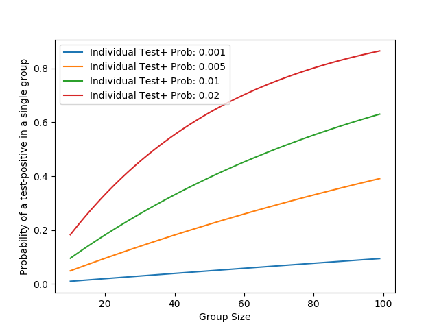

# Estimating the number of isolating people in a grouped system

Given a setting in which people are assigned to potentially overlapping groups of mutual contact (e.g. a school with classes, a university with class groups, sports, and household groups, etc) and entire groups isolate given a single detected COVID-19 case within the group, we might want an estimate at different levels of prevalence of how many people we would expect to be isolating at any given time.  This could be useful for planning - for example if a school might want to plan for in-person vs online delivery at different levels of isolation, or university households might need support when required to isolate.  

***As always, I am happy to discuss any of this, and would be very grateful if you let me know of any errors you may find.*** 
jessica.enright@glasgow.ac.uk

### Outline of Calculation
*(note that I use LaTeX notation for maths, but this should hopefully be understandable even if viewing without LaTeX parsing.  This is why maths is set apart in dollar-signs)*

This calculation is intentionally simple, and fails to include a dynamic disease model, transmission within the setting, different susceptibilities, etc.  

If we assume that every person in a system has an independent and equal probability $p_{pos}$ of testing positive, then the probability that a group of $k$ people will have no testing-positive person is: $(1-p_{pos})^k$, and thus a probability of at least one testing-positive person of $1-(1-p_{pos})^k$.  As an example, if each person in a group of 20 has an equal and uniform 1% probability of testing positive then the probability of at least one person in the group testing positive is: $1-0.99^{20}$, or approximately 18.2%.   Thus if we had a system of a large number of 20-person groupings with a general prevalence of test-positive prevalence of 1% in that system then we might expect about 18.2% of our groups to be isolating at any particular time.  

For systems with only one kind of non-overlapping group, we can then plot this expected percentage of isolating groups (and assuming that groups are all of the same size this is also the percentage of isolating people):

(as produced by the `plot_isolation_probabilities_one_layer()` function in file [`vanilla_number_isolating.py`](vanilla_number_isolating.py))

For example if you were conducting surveillance testing of students and the probability of a person testing positive was 1% per week (note that a recent REACT interim report places the prevalence in young people near 1%: https://www.imperial.ac.uk/media/imperial-college/institute-of-global-health-innovation/REACT1_12345_Interim-(1).pdf), then if students were in 30-person bubbles, you'd expect about about 26% of your bubbles to be required to isolate each week (and so if they were required to isolate for two weeks then about half of your bubbles might be isolating at any given time).

#### Multiple overlapping types of groups
If we continue with the simplifying assumptions used in the case of a single type of group (e.g. university student households) we can also consider other types of recorded groups (e.g. sports groups or tutorial groups).  In the easiest naive case, we might assume that these groups are completely independent of the first type of groups: that is, that if two people are in the same household that they are no more or less likely to be in the same sports group than two people who are not in the same household.  *I am planning as future work a simple expansion to include correlated groupings that do not require this assumption* 

In this case, we can calculate the proportion of people isolating due to a positive in one type of group and the proportion of people isolating due to a positive in the other type of group, and add these together while subtracting the expected overlap.  

As an example, if we have a group of people in which we expect 26% to be required to isolate in a week because of a positive in their household and 10% because of a positive in their tutorial group which **is unrelated to their household**, then we might expect $0.26 + 0.1 - 0.26*0.1 = 0.334$ or 33.4% to be required to isolate in a week.  

I have implemented a notebook with sliders to calculate this figure ([link to notebook](overlapping_groups_isolating.ipynb)), which you may wish to run at binder link (you will have to wait a minute to load, and then press 'Run' several times.):  [binder ling here](https://mybinder.org/v2/gh/magicicada/simple_epi_calculations/3c9002e8d0c53e65ab11b803825ebf5633e79121)

### Assumptions/limitations:
- this work includes no within-setting (within-school, within-university, etc) spread
- the probability of being tested positive (that is, both infected and receiving a test that gives a positive result) is uniform and independent over all people within the setting
- this work assumes a uniform constant infectious pressure, and takes no account of changing rates of infection nor an recovery/immunity, etc
- there is essentially no disease model here 
